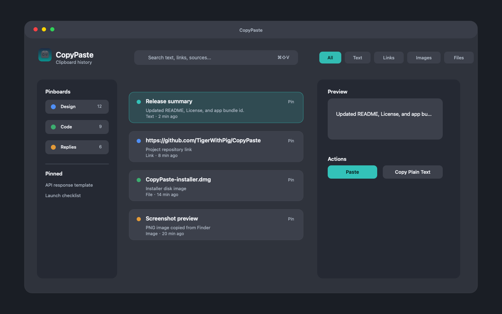
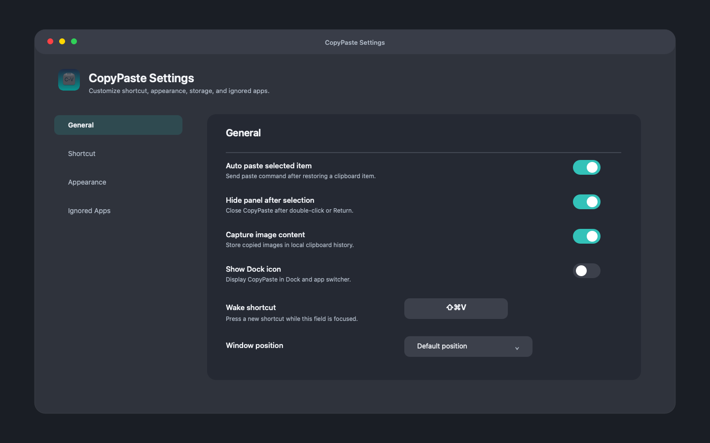

# CopyPaste

English | [简体中文](README.zh-CN.md)

CopyPaste is a lightweight native macOS clipboard manager. It stays in the menu bar, records recent clipboard items, and lets you quickly search, preview, pin, and paste them back into your current app.

CopyPaste is built with Objective-C and AppKit. It does not depend on Electron, SwiftUI, or third-party packages.

## Screenshots





## Features

- Menu bar clipboard history.
- Global shortcut: `Command + Shift + V`.
- Records text, links, images, and file URLs.
- Search and filter by content type.
- Pin frequently used items.
- Organize items with pinboards.
- Preview selected clipboard content.
- Paste selected content back into the active app.
- Copy as plain text when needed.
- Ignore clipboard content from selected apps, such as Keychain Access or password managers.
- Universal macOS build for Apple Silicon and Intel Macs.

## Requirements

- macOS 13.0 or later.
- Accessibility permission is required only for automatic paste.
- Xcode Command Line Tools are required only if you want to build from source.

## Install

Download the latest `CopyPaste-installer.dmg` from [Releases](../../releases).

Then:

1. Open `CopyPaste-installer.dmg`.
2. Drag `CopyPaste.app` into `Applications`.
3. Launch `CopyPaste` from `Applications`.
4. If macOS shows an "unidentified developer" warning, right-click `CopyPaste.app`, choose `Open`, then confirm.

This project currently uses ad-hoc signing for local trial builds. If you download a release build before it is notarized, macOS may ask for confirmation the first time you open it.

## First Run

CopyPaste appears in the macOS menu bar.

To use it:

1. Copy text, a link, an image, or a file.
2. Click the CopyPaste menu bar icon, or press `Command + Shift + V`.
3. Select an item from the history.
4. Paste it into the current app.

Automatic paste requires macOS Accessibility permission. If permission is not granted, CopyPaste will still put the selected item back on the system clipboard, and you can paste manually with `Command + V`.

## Accessibility Permission

To enable automatic paste:

1. Open `System Settings`.
2. Go to `Privacy & Security`.
3. Open `Accessibility`.
4. Enable `CopyPaste`.

You can still use CopyPaste without this permission, but automatic paste will be limited.

## Build From Source

Clone the repository, then run:

```bash
cd apps/macos
./scripts/package-universal.sh
```

The build output will be created at:

```text
apps/macos/outputs/CopyPaste.app
apps/macos/outputs/CopyPaste-universal.zip
```

To create a DMG installer:

```bash
cd apps/macos
./scripts/create-dmg.sh
```

The DMG will be created at:

```text
apps/macos/outputs/CopyPaste-installer.dmg
```

## Project Structure

```text
apps/macos/Sources/CopyPaste/  AppKit source code
apps/macos/Resources/          Info.plist and app icons
apps/macos/scripts/            Build, packaging, and icon scripts
apps/macos/outputs/            Generated app, zip, and dmg files
apps/macos/work/               Local temporary or previous build files
```

`apps/macos/outputs/`, `apps/macos/.build/`, and `apps/macos/work/` are ignored by git and should not be committed to the source repository. Release installers should be uploaded to GitHub Releases instead.

## Privacy

CopyPaste stores clipboard history locally on your Mac.

The local data file is stored under:

```text
~/Library/Application Support/CopyPaste/library.json
```

CopyPaste does not require a server account and does not upload clipboard content to a remote service.

Because clipboard history can contain sensitive content, you should avoid copying passwords, recovery keys, private tokens, or other secrets while any clipboard manager is running. You can add apps to the ignored bundle ID list in CopyPaste settings.

## Notes

CopyPaste is an original local AppKit application. It does not use Paste's brand, icon, or proprietary assets.

## License

CopyPaste is released under the [MIT License](LICENSE).
